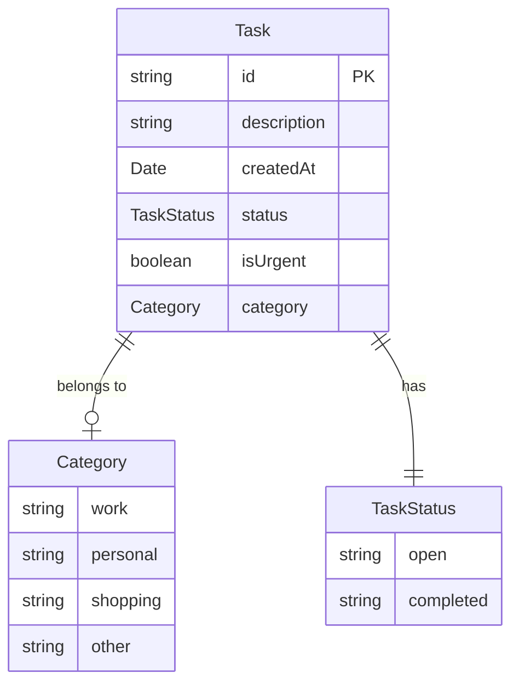
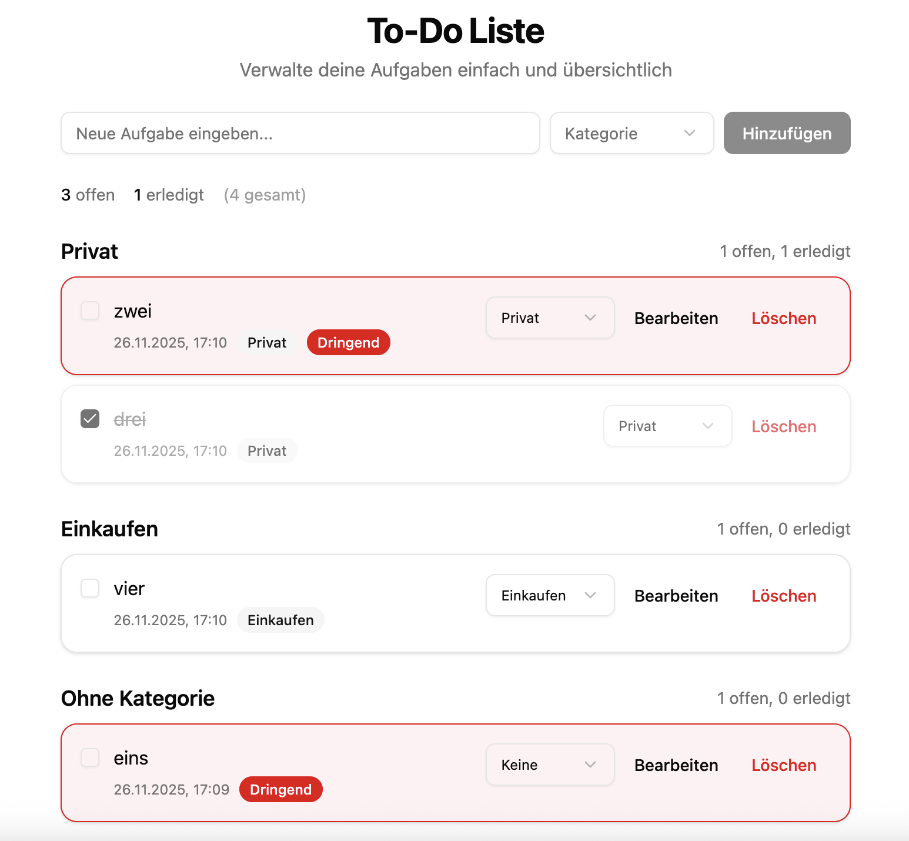
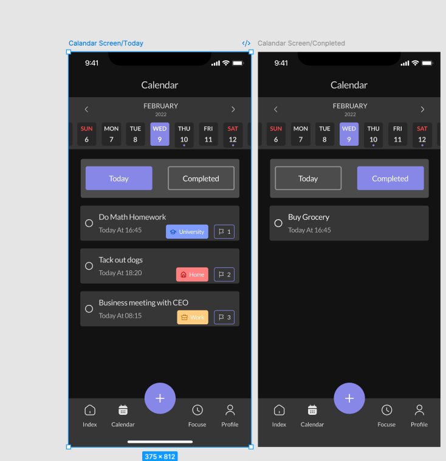
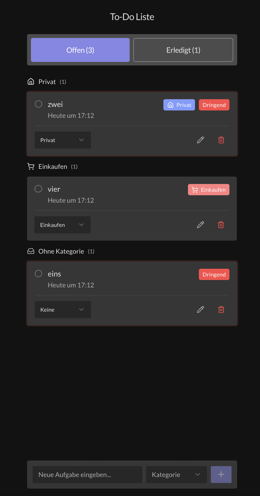
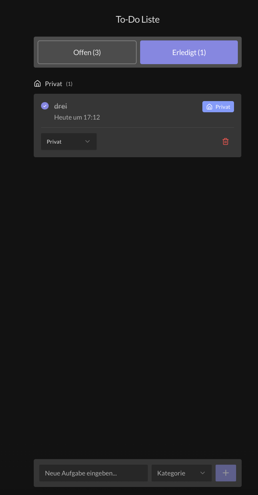

# Projekt-Reflexion: To-Do App

Eine Dokumentation des Entwicklungsprozesses einer React To-Do-Listen-Anwendung mit AI-gestützter Entwicklung.

---

## Projektübersicht

| Aspekt | Details |
|--------|---------|
| **Projekttyp** | React State Management & TypeScript Übung |
| **Zeitrahmen** | 26. November 2025 |
| **Tech Stack** | React 19, TypeScript 5.9, Vite 7, Tailwind CSS v4, shadcn/ui |
| **AI-Tools** | Claude Code, OpenSpec, Figma MCP |

---

## Phase 1: Anforderungsanalyse & Planung

### 1.1 Aufgabenstellung

Ausgangspunkt war die Kursaufgabe mit folgenden Anforderungen:

**Part 1 - Basis-Funktionalität:**
- To-Do-Einträge erstellen, bearbeiten, löschen
- Status-Toggle (offen/erledigt)
- Automatische "Dringend"-Markierung nach 60 Sekunden

**Part 2 - Erweiterung:**
- Kategorien-System (Arbeit, Privat, Einkaufen, Sonstiges)
- Gruppierte Anzeige nach Kategorien

### 1.2 Planungsschritte

```
Aufgabenstellung
      │
      ▼
┌─────────────────┐
│  1. Analyse     │  Requirements verstehen, Scope definieren
└────────┬────────┘
         │
         ▼
┌─────────────────┐
│  2. Datenmodell │  Entities, Beziehungen, Types
└────────┬────────┘
         │
         ▼
┌─────────────────┐
│  3. Architektur │  Komponenten-Struktur, State-Management
└────────┬────────┘
         │
         ▼
┌─────────────────┐
│  4. Tech Stack  │  Framework, Libraries, Tools
└────────┬────────┘
         │
         ▼
┌─────────────────┐
│  5. Specs       │  OpenSpec Proposal, Tasks, Validierung
└─────────────────┘
```

### 1.3 Datenmodell



### 1.4 Architektur

```
┌─────────────────────────────────────────────────────────┐
│                        App.tsx                          │
│                           │                             │
│                     TodoApp.tsx                         │
│            ┌─────────────┼─────────────┐                │
│            │             │             │                │
│      TodoForm.tsx  TodoSummary.tsx  CategoryGroup.tsx   │
│                                        │                │
│                                   TodoList.tsx          │
│                                        │                │
│                                   TodoItem.tsx          │
└─────────────────────────────────────────────────────────┘
                           │
                           ▼
┌─────────────────────────────────────────────────────────┐
│                    useTodos Hook                        │
│  ┌─────────────────────────────────────────────────┐   │
│  │ State: todos[]                                   │   │
│  │ Actions: add, toggle, edit, delete, moveCategory │   │
│  │ Computed: openCount, completedCount              │   │
│  └─────────────────────────────────────────────────┘   │
└─────────────────────────────────────────────────────────┘
```

### 1.5 Technologieauswahl

| Entscheidung | Begründung |
|--------------|------------|
| **Vite + React + TypeScript** | Schnelles Setup, moderner Build-Prozess, Type-Safety |
| **shadcn/ui** | Accessibility out-of-the-box, Radix UI Primitives, Tailwind-Integration |
| **Reine Frontend-App** | Zeitbegrenzung, kein Backend erforderlich laut Aufgabe |
| **OpenSpec** | Strukturierte, spec-driven Entwicklung mit AI |

---

## Phase 2: Implementierung

### 2.1 Projekt-Setup

```bash
# 1. Vite Projekt erstellen
npm create vite@latest -- --template react-swc-ts

# 2. Git Repository initialisieren
git init
```

### 2.2 OpenSpec Einrichtung

```bash
openspec init
```

```
openspec/
├── project.md              # Projektkonventionen
└── changes/
    └── add-todo-list-app/
        ├── proposal.md     # Was & Warum
        ├── tasks.md        # Implementierungs-Checkliste
        ├── design.md       # Technische Entscheidungen
        └── specs/
            └── todo-list/
                └── spec.md # Requirements & Scenarios
```

**Validierung:**
```bash
openspec validate add-todo-list-app --strict
```

### 2.3 shadcn/ui Integration

```bash
npx shadcn@latest init
```

**Import-Alias Konfiguration (tsconfig.json):**
```json
{
  "compilerOptions": {
    "baseUrl": ".",
    "paths": {
      "@/*": ["./src/*"]
    }
  }
}
```

### 2.4 Komponenten-Entwicklung

#### Part 1: Basis-Funktionalität

| Task | Datei | Beschreibung |
|------|-------|--------------|
| Data Model | `src/types/todo.ts` | Task-Interface, Status-Types, Helper-Funktionen |
| State Management | `src/hooks/useTodos.ts` | Custom Hook mit CRUD-Operationen |
| UI: Summary | `src/components/todo/TodoSummary.tsx` | Zähler offen/erledigt |
| UI: Form | `src/components/todo/TodoForm.tsx` | Eingabeformular |
| UI: Item | `src/components/todo/TodoItem.tsx` | Einzelne Aufgabe |
| UI: List | `src/components/todo/TodoList.tsx` | Listen-Rendering |
| UI: App | `src/components/todo/TodoApp.tsx` | Hauptkomponente |

#### Part 2: Kategorien-System

| Task | Änderung |
|------|----------|
| Category Data Model | `src/types/todo.ts` - Category-Type, CATEGORIES-Array |
| Category Features | `useTodos.ts` - `moveToCategory()` Funktion |
| UI: Select | shadcn Select-Komponente hinzugefügt |
| UI: CategoryGroup | Neue Komponente für gruppierte Anzeige |

### 2.4 Git Commits

```bash
git commit -m "feat: implement todo list application (Part 1)"
git commit -m "feat: add category system (Part 2)"
```

---

## Phase 3: UI Overhaul (Change Request)

### 3.1 Motivation

Nach Abschluss der funktionalen Implementierung wurde ein UI Overhaul als Change Request initiiert, um das Wireframe-Design durch ein modernes Dark-Mode-Design zu ersetzen.

### 3.2 Ansatz

**Erster Versuch: UX Pilot (Figma Plugin)**
- Ziel: Automatische Design-Generierung aus dem bestehenden Wireframe
- Ergebnis: Aufgrund eines Bugs im Plugin nicht erfolgreich

**Zweiter Ansatz: Fertiges Figma Community Design**
- Verwendung eines bestehenden, professionellen UI Kits
- Design-Tokens und Patterns per Figma MCP extrahiert

### 3.3 Ausgangsdesign (Wireframe)

Das ursprüngliche Design basierte auf shadcn/ui Komponenten im Light Mode:



**Merkmale:**
- Light Mode mit weißem Hintergrund
- Einfache Card-Komponenten
- Text-basierte Buttons ("Bearbeiten", "Löschen")
- Kategorie-Gruppierung mit Zählern
- Rote Border für dringende Tasks

### 3.4 Zieldesign (Figma)

Als Vorlage diente das **Jeday To Do List App UI Kit** aus der Figma Community:

> **Figma Community:** [Jeday To Do List App UI Kit](https://www.figma.com/community/file/1083383246788717048)



**Übernommene Design-Elemente:**
- Dark Mode mit #121212 Background
- Lila Primary Color (#8687E7)
- Task-Cards mit Ring-Checkboxen
- Farbige Kategorie-Badges
- Tab-Filter (Today/Completed)
- Typografie: Lato Font

**Nicht übernommen** (außerhalb Scope):
- Kalender-Header/Wochenansicht
- Bottom Navigation
- Prioritäts-Flags

### 3.5 OpenSpec Change Request

```
openspec/changes/ui-overhaul/
├── proposal.md     # UI Overhaul Begründung
├── tasks.md        # Design-Tasks
├── design.md       # Design-Tokens, Entscheidungen
└── specs/
    └── todo-app/
        └── spec.md # Animation & Design Requirements
```

### 3.6 Figma MCP Integration

Der lokale Figma MCP Server ermöglichte direkten Zugriff auf das Design:

```typescript
// Screenshot der aktuellen Selektion abrufen
mcp__figma-desktop__get_screenshot()

// Design-Kontext mit generiertem Code
mcp__figma-desktop__get_design_context()
```

### 3.7 Extrahierte Design-Tokens

```css
/* Farbpalette (Dark Mode) */
--background: #121212;
--card: #363636;
--primary: #8687E7;
--muted-foreground: #AFAFAF;
--destructive: #FF4949;

/* Kategorie-Farben */
--category-work: #FFCC80;
--category-personal: #809CFF;
--category-shopping: #FF8080;
--category-other: #80FFD4;
```

### 3.8 Implementierte Features

| Feature | Implementierung |
|---------|-----------------|
| Dark Mode | CSS-Variablen in `:root` |
| Tab-Filter | `TodoSummary.tsx` - Offen/Erledigt Tabs |
| Task-Cards | `TodoItem.tsx` - Neues Card-Layout |
| Ring-Checkbox | Custom Button mit border-radius |
| Category-Badges | Farbige Badges mit Icons (Lucide) |
| Floating Form | Fixed Position am unteren Rand |
| Animationen | tw-animate-css + custom Keyframes (`task-enter`, `check-pop`, `urgent-pulse`) |
| Reduced Motion | `@media (prefers-reduced-motion: reduce)` |

### 3.9 Geänderte Dateien

```
src/
├── index.css                        # Design-Tokens, Animationen
└── components/todo/
    ├── TodoApp.tsx                  # Layout, Filter-State
    ├── TodoSummary.tsx              # Tab-Filter
    ├── TodoItem.tsx                 # Card-Design, Badges
    ├── TodoForm.tsx                 # Floating Form
    ├── TodoList.tsx                 # Vereinfacht
    └── CategoryGroup.tsx            # Category Icons
```

### 3.10 Ergebnis

Das finale Design nach dem UI Overhaul:

| Offen-Tab | Erledigt-Tab |
|-----------|--------------|
|  |  |

---

## Phase 4: Testing & Qualitätssicherung

### 4.1 Build-Validierung

```bash
npm run build   # TypeScript Kompilierung + Vite Build
npm run lint    # ESLint Prüfung
```

### 4.2 Manuelle Tests

- Funktionale Tests aller CRUD-Operationen
- Tab-Filter Wechsel
- Kategorie-Zuweisung und -Wechsel
- Dringend-Markierung nach 60 Sekunden
- Responsive Verhalten
- Tastaturnavigation

### 4.3 Accessibility

- Screenreader-kompatible Labels
- Fokus-States für alle interaktiven Elemente
- `prefers-reduced-motion` Unterstützung

---

## Learnings & Reflexion

### Was gut funktioniert hat

1. **OpenSpec Workflow** - Strukturierte Planung vor der Implementierung verhinderte Scope Creep
2. **shadcn/ui** - Schnelle UI-Entwicklung mit guter Accessibility
3. **Figma MCP** - Nahtlose Integration von Design-Tokens ohne manuelles Kopieren
4. **Type-Safety** - TypeScript fing viele Fehler zur Compile-Zeit

### Herausforderungen

1. **Präzise Spec-Planung** - Requirements mussten klar definiert und validiert werden, um Nacharbeit zu vermeiden
2. **Technologieauswahl** - Abwägung zwischen Feature-Umfang und Zeitaufwand (z.B. keine State-Library für diesen Scope)
3. **Design-Pivot** - UX Pilot Bug erforderte schnellen Wechsel zu alternativem Ansatz

### Verbesserungspotential

- [ ] Persistierung (localStorage) hinzufügen
- [ ] Unit Tests mit Vitest
- [ ] E2E Tests mit Playwright
- [ ] Drag & Drop für Reordering
- [ ] Dark/Light Mode Toggle

---

## Verwendete Tools & Ressourcen

| Tool | Zweck |
|------|-------|
| **Claude Code** | AI-gestützte Entwicklung |
| **OpenSpec** | Spec-driven Development |
| **Figma + MCP** | Design-to-Code Pipeline |
| **Vite** | Build Tool |
| **React 19** | UI Framework |
| **TypeScript 5.9** | Type-Safety |
| **Tailwind CSS v4** | Styling |
| **tw-animate-css** | Animationen |
| **shadcn/ui** | UI Components |
| **Radix UI** | Accessible Primitives |
| **Lucide React** | Icons |

---

## Fazit

Das Projekt demonstriert einen strukturierten Entwicklungsworkflow:

1. **Planung** - Datenmodell, Architektur und Specs vor der Implementierung
2. **Implementierung** - Schrittweise Umsetzung mit Type-Safe React Components
3. **Change Request** - UI Overhaul als separater, dokumentierter Change
4. **Testing** - Build-Validierung und manuelle Qualitätssicherung

Die Kombination aus spec-driven Development und AI-Assistenz ermöglichte eine effiziente Umsetzung bei gleichzeitiger Dokumentation des gesamten Prozesses.
